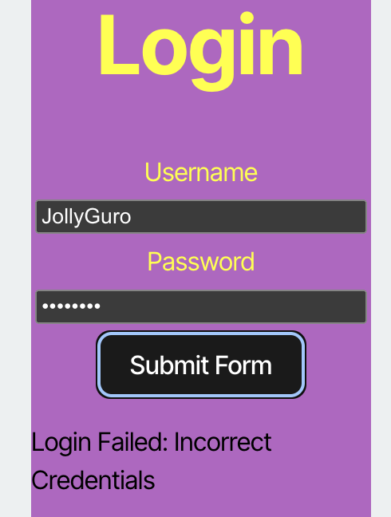
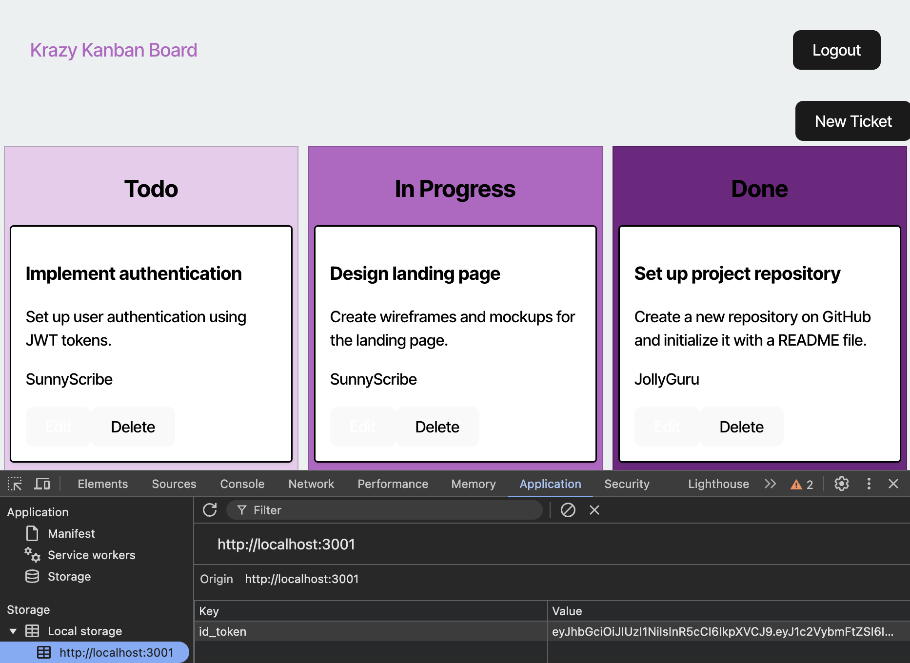

# Kanban with JWT Authentication

## Description

This project was an exercise to add JWT (JSON Web Token) authentication to existing code for a Kanban board. When a user tries to log in, their credentials are verified using bcrypt to compare the entered password with the stored password in the database. If the verification passes, JWT generates a token which is added to local storage for a given time period. Any time a user attempts to access or add new tickets to the Kanban board, this token is checked to make sure they are logged in with verified credentials. After 1 hour, or when a user logs out, the token is removed from local storage, and the user will have to log in again.

## Usage

This application is deployed live at 

The database has been pre-seeded with a few example users, which can be found in server/src/seeds/user-seeds.ts. If you attempt to log in with incorrect credentials, you'll get an error message:

As long as you use credentials provided in user-seeds.ts, you will be able to log in successfully to use the Kanban board. The JWT is stored in local storage as id_token:

Click "New Ticket" to create a new ticket, and simply enter the desired information. Tickets can be deleted by clicking the respective "Delete" button. Ticket editing has not been configured.

## Credits

Most of the code was provided by edX / University of Minnesota Full-Stack Coding Bootcamp. I filled in code using examples from Module 14 Activities 25 and 26.

## License

This application uses an MIT License.
